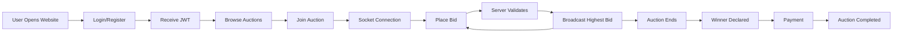
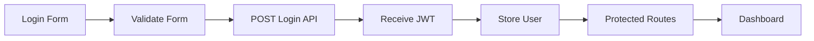
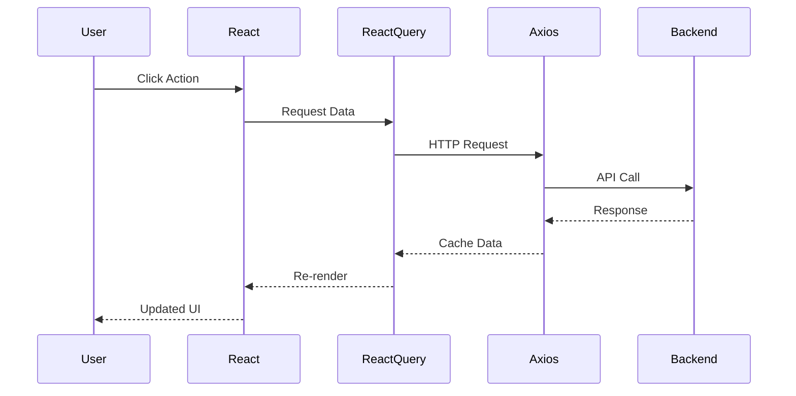
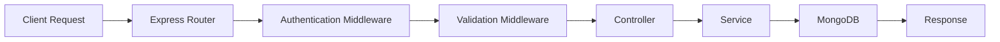
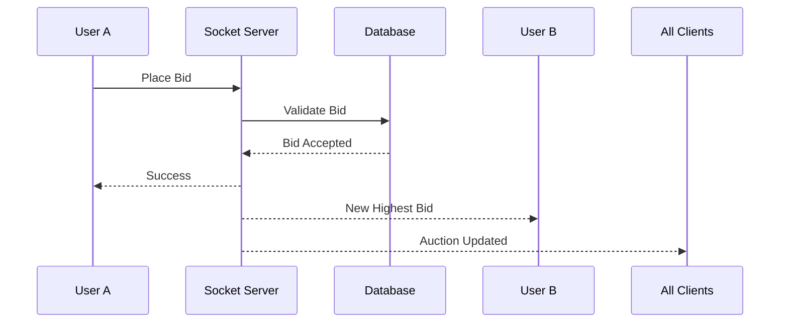
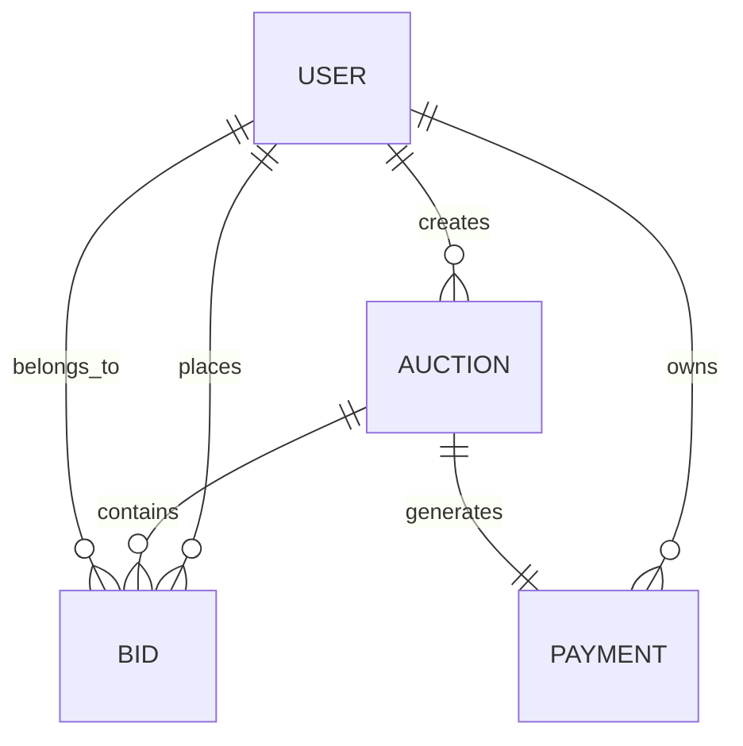
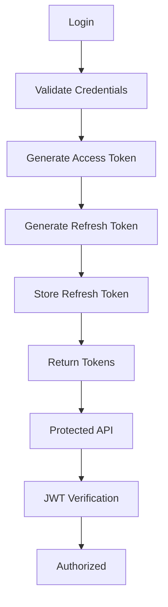
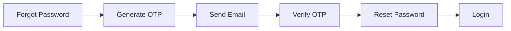
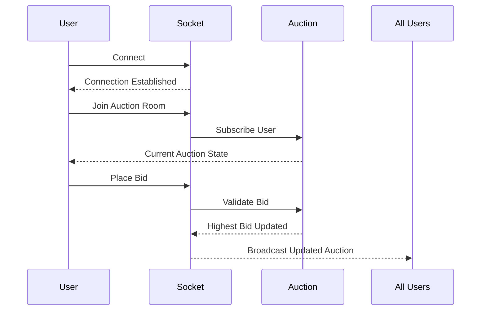
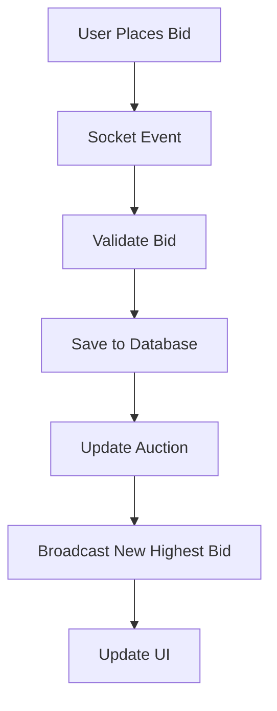

# 🔥 Bidding Wars

> A modern, production-ready real-time online auction platform built using the MERN stack with secure authentication, live bidding through Socket.IO, payment integration, cloud image storage, and an intuitive marketplace experience.

---

## 📖 Overview

Bidding Wars is a full-stack online auction platform where users can create auctions, participate in live bidding sessions, securely manage payments, and interact with listings in real time.

Unlike traditional marketplace applications that rely on periodic API polling, Bidding Wars uses **WebSockets (Socket.IO)** to instantly synchronize bids across all connected users, ensuring every participant sees the latest auction state without refreshing the page.

The project follows a modular architecture separating authentication, auctions, payments, uploads, dashboard analytics, and user management into independent modules, making it highly scalable and maintainable.

Whether a user wants to sell collectibles, electronics, vehicles, artwork, or any auctionable item, Bidding Wars provides an end-to-end solution from listing creation to auction completion.

---

# ✨ Features

## Authentication

- Secure JWT Authentication
- Google OAuth Login
- Refresh Token Support
- Forgot Password
- Password Reset
- Email Verification
- OTP Verification
- Protected Routes
- Session Persistence

---

## User Management

- User Profiles
- Avatar Upload
- Account Settings
- Secure Logout
- Token Refresh
- Profile Updates

---

## Auction Management

- Create Auctions
- Edit Auctions
- Delete Auctions
- Browse Marketplace
- Auction Details
- Category Based Auctions
- Auction Scheduling
- Image Upload
- Bid History
- Auction Status Tracking

---

## Live Bidding

- Real-time Bid Updates
- Socket.IO Integration
- Automatic Highest Bid Detection
- Live Bid Notifications
- Multiple Concurrent Users
- Instant Auction Synchronization

---

## Payments

- Secure Payment Gateway Integration
- Payment Verification
- Transaction Tracking
- Order Creation
- Payment Validation

---

## Dashboard

- User Dashboard
- Auction Statistics
- Active Auctions
- Won Auctions
- Revenue Overview
- User Activity

---

## Media Handling

- Cloud Image Upload
- ImageKit Integration
- Cloudinary Support
- Optimized Asset Delivery

---

## Security

- JWT Authentication
- Password Hashing
- Zod Validation
- Protected APIs
- Input Sanitization
- Environment Variables
- Secure Cookies
- CORS Protection

---

## Developer Experience

- TypeScript
- ESLint
- Modular Folder Structure
- Swagger API Documentation
- Docker Support
- Production Logging
- Environment Based Configuration
- RESTful APIs

---

# 🛠 Tech Stack

## Frontend

- React 19
- TypeScript
- Vite
- Redux Toolkit
- TanStack React Query
- React Router
- Axios
- Tailwind CSS

---

## Backend

- Node.js
- Express 5
- TypeScript
- MongoDB
- Mongoose

---

## Real-Time

- Socket.IO

---

## Authentication

- JWT
- Google OAuth
- bcrypt

---

## Validation

- Zod

---

## Cloud Services

- ImageKit
- Cloudinary

---

## Email Service

- Brevo (SMTP)

---

## API Documentation

- Swagger

---

## DevOps

- Docker
- Docker Compose

---

## Logging

- Pino Logger

---

## Testing

- Jest

---

# 🏗 High Level Architecture

```text
                    ┌──────────────────────────┐
                    │        Browser           │
                    │     React + Vite App     │
                    └────────────┬─────────────┘
                                 │
                    REST APIs + WebSockets
                                 │
                ┌────────────────▼────────────────┐
                │         Express Server          │
                │                                │
                │ Authentication                 │
                │ Auctions                       │
                │ Dashboard                      │
                │ Payments                       │
                │ Uploads                        │
                │ Socket.IO Gateway              │
                └──────────────┬─────────────────┘
                               │
         ┌─────────────────────┼─────────────────────┐
         │                     │                     │
         ▼                     ▼                     ▼
   MongoDB Database      ImageKit/Cloudinary     Brevo Email
         │
         ▼
 Persistent Auction Data
 Users
 Bids
 Payments
 Sessions
```

---

# 🧱 Project Architecture

The project follows a modular architecture where every business domain is isolated into its own feature module.

```text
Client
│
├── Authentication
├── Marketplace
├── Auctions
├── Dashboard
├── Payments
├── Shared Components
└── State Management


Server
│
├── Auth Module
├── Auction Module
├── Dashboard Module
├── Payment Module
├── Upload Module
├── Socket Module
├── Middlewares
├── Utilities
└── Database
```

This separation keeps the codebase clean, easier to scale, and allows independent development of each module without affecting others.

---

# 🚀 Core Workflow



---

# 📂 Repository Structure

```text
Bidding-Wars

├── Client
│
│   ├── src
│   ├── api
│   ├── app
│   ├── assets
│   ├── features
│   ├── hooks
│   ├── routes
│   ├── utils
│   └── components
│
├── server
│
│   ├── src
│   ├── config
│   ├── modules
│   ├── middleware
│   ├── routes
│   ├── services
│   ├── socket
│   ├── utils
│   ├── validators
│   └── tests
│
└── docker
```

---

# 🎯 Design Goals

The project was built with the following objectives:

- Real-time auction synchronization
- Secure authentication
- Modular architecture
- Scalable backend
- Production-ready API design
- Cloud-native media handling
- Type safety using TypeScript
- Easy deployment using Docker
- Maintainable codebase
- Developer-friendly folder organization
# 🖥 Frontend Architecture

The frontend is built using **React 19**, **TypeScript**, **Vite**, **Redux Toolkit**, **TanStack React Query**, and **Tailwind CSS**. It follows a feature-based architecture that separates business logic, state management, reusable UI components, and API communication, making the application scalable and maintainable.

Instead of placing everything inside a single components folder, the application is divided into independent feature modules where each module owns its pages, hooks, APIs, and state.

---

# Frontend Tech Stack

| Technology | Purpose |
|------------|---------|
| React 19 | UI Library |
| TypeScript | Type Safety |
| Vite | Development & Build Tool |
| Tailwind CSS | Styling |
| Redux Toolkit | Global State |
| TanStack React Query | Server State |
| React Router | Routing |
| Axios | HTTP Client |
| Socket.IO Client | Live Bidding |
| React Hook Form | Forms |
| Zod | Validation |

---

# Client Folder Structure

```text
client
│
├── src
│
├── api
│   ├── auth
│   ├── auction
│   ├── payment
│   ├── upload
│   └── dashboard
│
├── app
│   ├── store.ts
│   ├── provider.tsx
│   └── queryClient.ts
│
├── assets
│
├── components
│   ├── common
│   ├── ui
│   ├── layout
│   ├── cards
│   ├── forms
│   └── modals
│
├── features
│
│   ├── auth
│   ├── auctions
│   ├── dashboard
│   ├── profile
│   ├── payments
│   └── home
│
├── hooks
│
├── routes
│
├── services
│
├── types
│
├── utils
│
└── main.tsx
```

---

# Application Boot Flow

When the application starts, React initializes the application, configures providers, loads the Redux store, initializes React Query, and mounts the router.

```text
Browser

↓

main.tsx

↓

App.tsx

↓

Redux Provider

↓

React Query Provider

↓

Router Provider

↓

Application Routes

↓

Pages

↓

Components
```

---

# Frontend Architecture

```text
                 React Application

                        │
        ┌───────────────┼───────────────┐
        │               │               │
     Components      Feature Pages    Shared Hooks
        │               │
        └───────┬───────┘
                │
          React Query Hooks
                │
             Axios API
                │
          Express Backend
```

---

# State Management

The frontend separates state into two categories.

## Global State

Managed using Redux Toolkit.

Examples include:

- Logged in user
- Authentication status
- Theme
- Sidebar state
- Global UI state

---

## Server State

Managed using TanStack React Query.

Examples include:

- Auction list
- Auction details
- Dashboard statistics
- Bid history
- Payments
- Profile information

This keeps API caching separate from UI state and greatly reduces unnecessary Redux complexity.

---

# Redux Architecture

```text
Redux Store

│

├── authSlice

├── userSlice

├── uiSlice

└── other feature slices
```

Each slice manages only one responsibility.

Example:

```text
Auth Slice

Login

↓

Store User

↓

Store Access Token

↓

Authentication State Updated

↓

Protected Routes Accessible
```

---

# React Query Architecture

Instead of manually managing loading states and caching, React Query automatically handles:

- API requests
- Caching
- Background refetching
- Request deduplication
- Loading state
- Error state

Workflow:

```text
Component

↓

useQuery()

↓

React Query Cache

↓

Axios Request

↓

Backend API

↓

Cache Updated

↓

UI Re-rendered
```

---

# API Layer

Every feature communicates with the backend through dedicated API modules.

```text
api

│

├── auth.api.ts

├── auction.api.ts

├── payment.api.ts

├── upload.api.ts

└── dashboard.api.ts
```

Advantages:

- Centralized API logic
- Easy maintenance
- Reusable requests
- Cleaner components

---

# Routing Architecture

React Router manages all navigation.

```text
/

├── Login

├── Register

├── Marketplace

├── Auctions

├── Dashboard

├── Profile

├── Payments

└── Settings
```

Protected routes ensure only authenticated users can access private pages.

```text
User

↓

Protected Route

↓

Authenticated?

↓

YES ─────────► Page

NO ─────────► Login
```

---

# Feature Modules

Each business domain owns its own code.

Example:

```text
features

│

├── auth

│   ├── pages

│   ├── hooks

│   ├── components

│   └── validation

│

├── auctions

│   ├── pages

│   ├── components

│   ├── hooks

│   └── services

│

├── dashboard

├── payments

└── profile
```

This prevents unrelated code from becoming tightly coupled.

---

# Component Architecture

The UI follows a reusable component hierarchy.

```text
Page

↓

Section

↓

Cards

↓

Buttons

↓

Inputs

↓

Typography
```

Example:

```text
Auction Page

↓

Auction Header

↓

Auction Details

↓

Current Bid Card

↓

Bid Form

↓

Bid History

↓

Similar Auctions
```

---

# Authentication Flow



---

# Live Bidding Flow

The frontend establishes a persistent Socket.IO connection after joining an auction.

```text
Auction Page

↓

Socket Connected

↓

Listen for Bid Events

↓

Receive Highest Bid

↓

Update React Query Cache

↓

UI Instantly Updates
```

Unlike polling, this allows every participant to see new bids immediately.

---

# File Responsibilities

| Folder | Responsibility |
|---------|----------------|
| api | Backend communication |
| app | Global providers |
| assets | Images & static assets |
| components | Reusable UI |
| features | Business modules |
| hooks | Custom React hooks |
| routes | Routing |
| services | Shared logic |
| utils | Helper functions |
| types | Shared TypeScript types |

---

# Frontend Design Principles

The frontend was designed around several engineering principles:

- Feature-first architecture
- Reusable UI components
- Strong type safety
- Separation of concerns
- Centralized API communication
- Predictable global state
- Efficient server-state caching
- Responsive design
- Scalable routing
- Easy maintainability

---

# Frontend Request Lifecycle


# ⚙️ Backend Architecture

The backend is built using **Node.js**, **Express 5**, **TypeScript**, and **MongoDB** following a modular architecture. Every business domain is isolated into its own module, making the application easy to maintain, extend, and test.

Instead of having a single large server file, responsibilities are divided into controllers, services, models, routes, middlewares, validators, and utilities.

---

# Backend Tech Stack

| Technology | Purpose |
|------------|---------|
| Node.js | Runtime |
| Express 5 | REST API Framework |
| TypeScript | Type Safety |
| MongoDB | Database |
| Mongoose | ODM |
| JWT | Authentication |
| Socket.IO | Real-time Communication |
| Zod | Validation |
| Pino | Logging |
| Swagger | API Documentation |
| Docker | Containerization |

---

# Server Folder Structure

```text
server
│
├── src
│
├── config
│   ├── database.ts
│   ├── env.ts
│   ├── logger.ts
│   ├── swagger.ts
│   └── cloud.ts
│
├── modules
│
│   ├── auth
│   ├── auction
│   ├── payment
│   ├── dashboard
│   ├── upload
│   ├── notification
│   └── user
│
├── middleware
│
│   ├── auth.middleware.ts
│   ├── error.middleware.ts
│   ├── validate.middleware.ts
│   ├── upload.middleware.ts
│   └── rateLimiter.ts
│
├── socket
│
├── services
│
├── utils
│
├── validators
│
├── routes
│
├── models
│
├── types
│
├── tests
│
└── server.ts
```

---

# Layered Architecture

The backend follows a layered architecture.

```text
                 HTTP Request

                      │

                 Express Router

                      │

                 Middleware

                      │

                 Controller

                      │

                   Service

                      │

                 Database Model

                      │

                   MongoDB

                      │

               HTTP Response
```

Each layer has a single responsibility.

---

# Request Lifecycle

Every request follows the same execution pipeline.



---

# Module Architecture

Every feature is completely isolated.

Example:

```text
auction

│

├── auction.controller.ts

├── auction.service.ts

├── auction.routes.ts

├── auction.model.ts

├── auction.validation.ts

└── auction.types.ts
```

Advantages:

- Better scalability
- Independent development
- Easier debugging
- Easier testing
- Clean separation of concerns

---

# Controller Layer

Controllers are responsible only for handling HTTP requests.

Responsibilities include:

- Reading request parameters
- Calling service methods
- Returning API responses
- Handling status codes

Controllers never contain business logic.

```text
Request

↓

Controller

↓

Service

↓

Response
```

---

# Service Layer

The service layer contains all business logic.

Examples include:

- Creating auctions
- Ending auctions
- Validating bids
- Processing payments
- Sending emails
- Uploading images
- Authentication logic

The service layer can communicate with multiple models if required.

---

# Database Layer

MongoDB stores all application data.

Major collections include:

```text
Users

Auctions

Bids

Payments

Notifications

Sessions
```

Mongoose models provide:

- Schema validation
- Relationships
- Query helpers
- Middleware hooks
- Type safety

---

# Middleware Pipeline

The middleware layer executes before reaching controllers.

```text
Incoming Request

↓

Logger

↓

CORS

↓

JSON Parser

↓

Authentication

↓

Validation

↓

Route Controller
```

Each middleware has one responsibility.

---

# Authentication Middleware

Protected APIs require a valid JWT.

Authentication flow:

```text
Authorization Header

↓

Extract JWT

↓

Verify Token

↓

Find User

↓

Attach User to Request

↓

Next()
```

If verification fails, the request immediately returns **401 Unauthorized**.

---

# Validation Layer

Incoming request bodies are validated using **Zod** before reaching business logic.

Example validations include:

- Login
- Registration
- Auction creation
- Bid placement
- Password reset
- Profile update

Advantages:

- Prevents invalid data
- Cleaner controllers
- Better error messages
- Strong type inference

---

# Error Handling

A centralized error handler manages every application error.

```text
Controller

↓

Throw Error

↓

Global Error Middleware

↓

Formatted JSON Response
```

Example response:

```json
{
  "success": false,
  "message": "Auction not found"
}
```

Centralized error handling keeps the API consistent across all endpoints.

---

# Logging

The application uses **Pino** for structured production logging.

Logs include:

- Incoming requests
- Response status
- Errors
- Database connection
- Socket events

Example:

```text
INFO  User Logged In

INFO  Auction Created

INFO  Bid Received

ERROR Payment Verification Failed
```

---

# Socket.IO Architecture

Real-time communication is handled separately from REST APIs.

```text
Client

↓

Socket Connection

↓

Auction Room

↓

Bid Event

↓

Server Validation

↓

Broadcast Highest Bid

↓

Connected Clients
```

Each auction acts as an independent Socket.IO room, ensuring that only participants of a specific auction receive updates.

---

# Live Bidding Flow



---

# Configuration Management

The application separates configuration from business logic.

Configuration includes:

- Database connection
- JWT secrets
- Cloudinary keys
- ImageKit credentials
- SMTP credentials
- Payment gateway secrets
- Client URL
- Environment variables

This allows seamless switching between development and production environments.

---

# Utility Layer

Shared helper functions are stored separately to avoid duplication.

Examples:

```text
Generate JWT

Generate OTP

Hash Password

Compare Password

Upload Image

Send Email

Pagination Helper

Date Formatter
```

Utilities are stateless and reusable across modules.

---

# Security Features

The backend includes several production-grade security practices.

- JWT Authentication
- Password hashing using bcrypt
- Zod request validation
- Protected routes
- Secure environment variables
- CORS configuration
- Secure cookies
- Centralized error handling
- Input sanitization
- Authentication middleware
- Token expiration
- Refresh token support

---

# Backend Design Principles

The server is designed with the following engineering principles:

- Modular architecture
- Layered design
- Single responsibility principle
- Separation of concerns
- Feature-based organization
- Reusable services
- Strong type safety
- Production logging
- Scalable REST APIs
- Real-time communication support

---

# Complete Backend Flow

```mermaid
flowchart TD

Client

↓

Express Router

↓

Authentication Middleware

↓

Validation Middleware

↓

Controller

↓

Business Service

↓

MongoDB

↓

Socket.IO Broadcast

↓

JSON Response

↓

Frontend Update
```
# 🗄 Database Design

The application uses **MongoDB** as its primary database with **Mongoose** as the Object Data Modeling (ODM) library. MongoDB's flexible document structure makes it ideal for handling auctions, bids, users, payments, and other dynamic data.

Each business module owns its own collection, resulting in a clean and scalable database design.

---

# Database Collections

```text
MongoDB

│

├── users

├── auctions

├── bids

├── payments

├── notifications

├── sessions

├── otp

└── uploads
```

---

# Database Relationships

```text
User

│

├──────────────┐

│              │

▼              ▼

Auctions      Payments

│

▼

Bids

│

▼

Winning User
```

One user can create multiple auctions, and each auction can receive multiple bids from different users.

---

# Entity Relationship Diagram



---

# User Collection

Stores account information and authentication details.

Typical fields include:

```text
_id

name

email

password

avatar

googleId

isVerified

refreshToken

createdAt

updatedAt
```

Responsibilities

- User authentication
- Profile management
- Password reset
- Google login
- Email verification

---

# Auction Collection

Represents an auction listing.

Typical fields include:

```text
_id

title

description

category

images

startingPrice

currentBid

minimumIncrement

seller

winner

status

startTime

endTime

createdAt

updatedAt
```

Responsibilities

- Store auction details
- Current highest bid
- Seller information
- Winner information
- Auction lifecycle

---

# Bid Collection

Stores every bid placed during an auction.

Typical fields include:

```text
_id

auctionId

bidder

amount

createdAt
```

Responsibilities

- Bid history
- Highest bid calculation
- Live bidding synchronization
- Audit trail

---

# Payment Collection

Stores completed payment transactions.

Typical fields include:

```text
_id

auction

buyer

seller

amount

orderId

paymentId

status

createdAt
```

Responsibilities

- Payment verification
- Order tracking
- Transaction history

---

# OTP Collection

Used for account verification and password reset.

Typical fields include:

```text
_id

user

otp

expiresAt

purpose
```

---

# Notification Collection

Stores user notifications.

Examples

- Auction started
- Auction ended
- Outbid notification
- Payment successful
- Auction won

---

# Upload Collection

Tracks uploaded media.

Typical fields

```text
imageUrl

provider

publicId

uploadedBy
```

---

# Authentication Architecture

Authentication is built using **JWT Access Tokens**, **Refresh Tokens**, and optional **Google OAuth** support.

The system is designed to provide secure authentication while keeping users logged in across sessions.

---

# Authentication Flow



---

# Login Flow

```text
User

↓

Login Form

↓

POST /auth/login

↓

Validate Credentials

↓

Generate JWT

↓

Generate Refresh Token

↓

Store Refresh Token

↓

Return User Data
```

---

# Protected Route Flow

```text
Client Request

↓

Authorization Header

↓

JWT Middleware

↓

Verify Token

↓

Extract User

↓

Controller

↓

Success Response
```

---

# Refresh Token Flow

```text
Expired Access Token

↓

POST /auth/refresh

↓

Verify Refresh Token

↓

Generate New Access Token

↓

Return New JWT
```

This prevents users from repeatedly logging in while maintaining security.

---

# Password Reset Flow



---

# Google Authentication Flow

```text
User

↓

Google Login

↓

Google OAuth

↓

Verify User

↓

Generate JWT

↓

Login Success
```

---

# API Documentation

All APIs follow RESTful principles.

Base URL

```text
/api
```

Every response follows a consistent structure.

Success

```json
{
  "success": true,
  "message": "Operation completed successfully",
  "data": {}
}
```

Failure

```json
{
  "success": false,
  "message": "Something went wrong"
}
```

---

# Authentication APIs

## Register User

```http
POST /auth/register
```

Authentication Required

```text
No
```

Purpose

Creates a new account.

---

## Login

```http
POST /auth/login
```

Authentication Required

```text
No
```

Returns

- User information
- Access token
- Refresh token

---

## Google Login

```http
POST /auth/google
```

Authentication Required

```text
No
```

---

## Logout

```http
POST /auth/logout
```

Authentication Required

```text
Yes
```

---

## Refresh Token

```http
POST /auth/refresh
```

Authentication Required

```text
Refresh Token
```

---

## Current User

```http
GET /auth/me
```

Authentication Required

```text
Yes
```

---

## Forgot Password

```http
POST /auth/forgot-password
```

---

## Verify OTP

```http
POST /auth/verify-otp
```

---

## Reset Password

```http
POST /auth/reset-password
```

---

# Auction APIs

## Get All Auctions

```http
GET /auctions
```

Returns all active auctions.

---

## Get Auction Details

```http
GET /auctions/:auctionId
```

---

## Create Auction

```http
POST /auctions
```

Authentication

```text
Required
```

---

## Update Auction

```http
PATCH /auctions/:auctionId
```

---

## Delete Auction

```http
DELETE /auctions/:auctionId
```

---

## Start Auction

```http
POST /auctions/:auctionId/start
```

---

## End Auction

```http
POST /auctions/:auctionId/end
```

---

## Get Auction Bids

```http
GET /auctions/:auctionId/bids
```

---

## Place Bid

```http
POST /auctions/:auctionId/bid
```

Authentication

```text
Required
```

---

# Dashboard APIs

## Dashboard Overview

```http
GET /dashboard
```

Returns

- Active auctions
- Won auctions
- Earnings
- Statistics

---

# Upload APIs

## Upload Image

```http
POST /upload
```

---

## Delete Image

```http
DELETE /upload
```

---

## ImageKit Authentication

```http
GET /upload/imagekit-auth
```

---

# Payment APIs

## Create Order

```http
POST /payments/create-order
```

---

## Verify Payment

```http
POST /payments/verify
```

---

## Payment Details

```http
GET /payments/:paymentId
```

---

# Socket Events

The application uses Socket.IO for all live auction communication.

## Client → Server Events

```text
join-auction

leave-auction

place-bid

typing

disconnect
```

---

## Server → Client Events

```text
auction-updated

new-highest-bid

auction-ended

winner-announced

payment-required

notification
```

---

# HTTP Status Codes

| Code | Meaning |
|-------|----------|
| 200 | Success |
| 201 | Resource Created |
| 204 | Deleted Successfully |
| 400 | Bad Request |
| 401 | Unauthorized |
| 403 | Forbidden |
| 404 | Resource Not Found |
| 409 | Conflict |
| 422 | Validation Failed |
| 500 | Internal Server Error |

---

# API Design Principles

The backend APIs are designed following RESTful best practices.

- Consistent naming conventions
- Predictable request and response structure
- Proper HTTP status codes
- JWT-protected private routes
- Centralized validation
- Standardized error handling
- Modular route organization
- Scalable endpoint structure
- # 🔌 Real-Time Architecture

One of the core features of **Bidding Wars** is its real-time bidding system powered by **Socket.IO**. Instead of relying on frequent HTTP polling, the platform maintains persistent WebSocket connections between the client and the server, allowing bid updates to be broadcast instantly to every participant.

This ensures that all users see the latest auction state with minimal latency, creating a seamless live auction experience.

---

# Why Socket.IO?

Traditional REST APIs require the client to repeatedly ask the server for updates.

```text
Client

↓

GET /auction

↓

Server

↓

Response

↓

Repeat every few seconds
```

This introduces unnecessary requests, delays, and server overhead.

With Socket.IO, a single persistent connection is established.

```text
Client

⇄

Socket.IO Server
```

The server pushes updates immediately whenever a new bid is placed.

---

# Socket Architecture

```text
                    Client A
                        │
                        │
                Socket Connection
                        │
                        ▼
                Socket.IO Server
                        │
      ┌─────────────────┼─────────────────┐
      │                 │                 │
      ▼                 ▼                 ▼
 Auction Room      Auction Room      Auction Room
   (ID-101)          (ID-102)          (ID-103)
      │
 ┌────┴────┐
 ▼         ▼
Client B  Client C
```

Each auction operates inside its own Socket.IO room, ensuring that only users participating in a specific auction receive updates for that auction.

---

# Socket Connection Lifecycle



---

# Live Bidding Workflow



---

# Socket Events

## Client → Server

| Event | Description |
|---------|-------------|
| join-auction | Join an auction room |
| leave-auction | Leave current auction |
| place-bid | Submit a new bid |
| reconnect | Restore socket session |
| disconnect | Close connection |

---

## Server → Client

| Event | Description |
|---------|-------------|
| auction-updated | Auction information changed |
| highest-bid | New highest bid |
| auction-ended | Auction completed |
| winner-announced | Winning bidder |
| notification | General notification |
| payment-required | Winner must complete payment |

---

# Room Management

Each auction has an independent room.

```text
Auction ID

↓

Socket Room

↓

Connected Users

↓

Receive Live Events
```

This prevents unnecessary broadcasts across unrelated auctions.

---

# Bid Validation

Before broadcasting a bid, several validations are performed.

- Auction exists
- Auction is active
- Auction has not ended
- User is authenticated
- Bid exceeds current highest bid
- Bid increment rules are satisfied

Only after passing validation is the bid stored and broadcast.

---

# Payment Workflow

After an auction ends, the winner proceeds to payment.

```mermaid
flowchart LR

Auction Ends

↓

Winner Selected

↓

Create Payment Order

↓

Payment Gateway

↓

Verify Payment

↓

Store Transaction

↓

Payment Success

↓

Auction Completed
```

---

# Payment Lifecycle

```text
Winning Bid

↓

Create Order

↓

Payment Gateway

↓

Payment Verification

↓

Store Transaction

↓

Generate Receipt

↓

Notify Buyer & Seller
```

---

# Upload Pipeline

Images are uploaded through dedicated upload services before auction creation.

```mermaid
flowchart LR

User Uploads Image

↓

Validation

↓

Cloud Upload

↓

Receive URL

↓

Store URL in Database

↓

Display Image
```

---

# Cloud Storage

The application supports cloud-based media management.

Supported providers:

- Cloudinary
- ImageKit

Advantages

- Optimized image delivery
- CDN support
- Automatic transformations
- Reduced backend storage
- High availability

---

# Email Workflow

Emails are used for account verification, password recovery, and important auction events.

```text
Action

↓

Generate Email

↓

SMTP (Brevo)

↓

Send Email

↓

User Receives Notification
```

Common email types:

- Welcome email
- OTP verification
- Password reset
- Auction won
- Auction ended
- Payment confirmation

---

# Security

The application follows production-grade security practices to protect user accounts and auction data.

## Authentication

- JWT Access Tokens
- Refresh Tokens
- Google OAuth
- Protected Routes

---

## Password Security

- bcrypt hashing
- Salted passwords
- Password reset tokens
- OTP verification

---

## Request Validation

Every incoming request is validated using Zod schemas before reaching business logic.

Benefits:

- Prevents malformed requests
- Prevents invalid database writes
- Improves API reliability

---

## API Protection

- Authentication middleware
- Authorization checks
- Route protection
- Input validation
- Secure error responses

---

## Environment Variables

Sensitive credentials are never hardcoded.

Example variables:

```env
PORT=

NODE_ENV=

MONGODB_URI=

JWT_SECRET=

JWT_REFRESH_SECRET=

GOOGLE_CLIENT_ID=

GOOGLE_CLIENT_SECRET=

IMAGEKIT_PUBLIC_KEY=

IMAGEKIT_PRIVATE_KEY=

IMAGEKIT_URL_ENDPOINT=

CLOUDINARY_CLOUD_NAME=

CLOUDINARY_API_KEY=

CLOUDINARY_API_SECRET=

BREVO_API_KEY=

PAYMENT_SECRET=

CLIENT_URL=
```

---

# Docker Support

The project is containerized for consistent development and deployment.

Typical setup:

```text
Application

↓

Docker Container

↓

MongoDB Container

↓

Network

↓

Production Deployment
```

Benefits:

- Identical environments
- Easy onboarding
- Faster deployment
- Simplified dependency management

---

# Deployment Architecture

```mermaid
flowchart LR

GitHub

↓

CI/CD Pipeline

↓

Docker Build

↓

Production Server

↓

Node.js API

↓

MongoDB

↓

Cloud Services
```

---

# Performance Optimizations

Several techniques are used to ensure responsiveness and scalability.

## Frontend

- React Query caching
- Lazy loading
- Optimized API calls
- Component memoization
- Code splitting

---

## Backend

- Modular services
- Efficient MongoDB queries
- Connection pooling
- Structured logging
- Lightweight middleware

---

## Real-Time

- Room-based broadcasting
- Minimal socket payloads
- Event-driven updates
- Reduced HTTP polling

---

# Error Handling Strategy

Errors are handled consistently across the application.

```text
Exception

↓

Global Error Middleware

↓

Structured JSON Response

↓

Frontend Notification
```

Example:

```json
{
  "success": false,
  "message": "Auction has already ended",
  "error": null
}
```

---

# Testing Strategy

The project is designed with testing in mind.

Testing includes:

- Unit testing
- Integration testing
- API testing
- Authentication testing
- Socket event testing
- Validation testing

---

# Scalability Considerations

The architecture is designed to support future growth.

Possible enhancements include:

- Redis caching
- Horizontal scaling
- Microservices
- Queue-based notifications
- Search indexing
- CDN optimization
- Event streaming
- Background workers

---

# Future Improvements

Some planned enhancements for future releases include:

- Watchlist functionality
- AI-powered price recommendations
- Live auction chat
- Push notifications
- Multi-language support
- Advanced search filters
- Auction analytics
- Seller verification
- Mobile application
- Dark mode customization

---

# Contributing

Contributions are welcome.

To contribute:

1. Fork the repository.
2. Create a feature branch.
3. Commit your changes.
4. Push your branch.
5. Open a Pull Request.

Please ensure that your code follows the existing project structure and coding standards.

---

# License

This project is licensed under the **MIT License**.

---

# Developers

**Harshit Raghuwanshi**
**Bhavya Dhanwani**

Full Stack Developer passionate about building scalable web applications, real-time systems, and modern developer experiences.

---

# Acknowledgements

Special thanks to the open-source community and the maintainers of the technologies that power this project, including React, Node.js, Express, MongoDB, Socket.IO, TypeScript, Docker, Tailwind CSS, and all supporting libraries that made this application possible.
